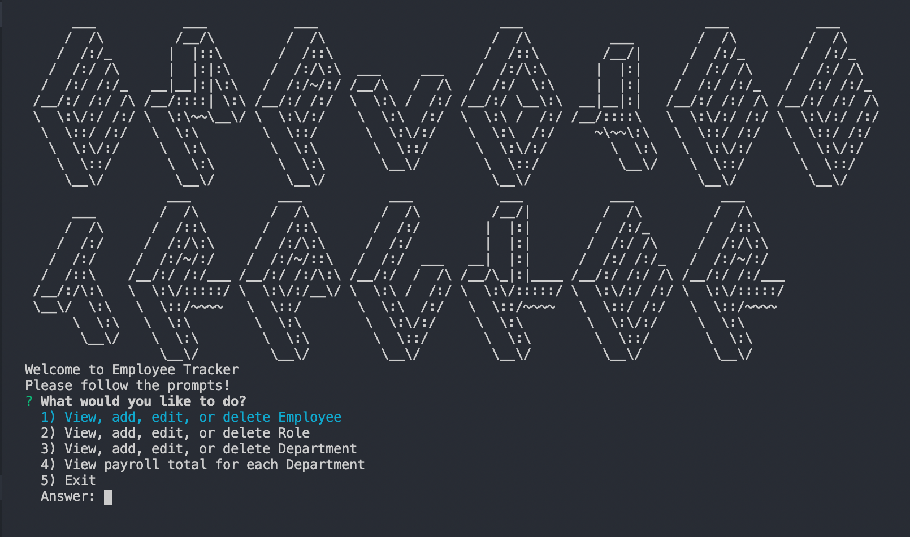
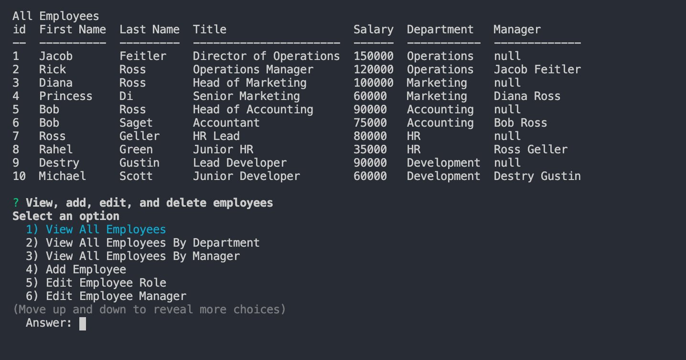
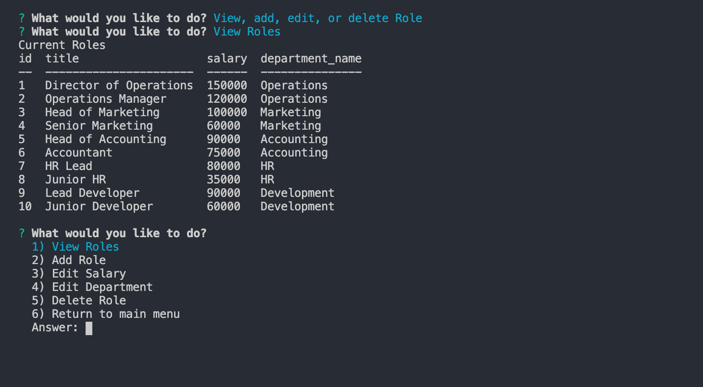
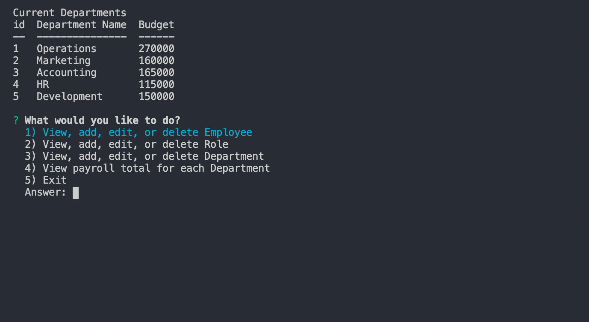

# Employee Tracker

## About

This command line application allows you to view, add, edit, and delete employees as well as their roles and departments. Data is stored in a mySQL database.

## Table of Contents

- [Files](#Files)
- [Installation](#Installation)
- [Usage](#Usage)
- [Contributions](#Contributions)
- [Testing](#Testing)
- [Credits](#Credits)
- [License](#License)
- [Contact](#Contact)

## Files

- employee-tracker.html
- README.md
- LICENSE
- package.json
- (assets)
  - schemas.sql
  - seeds.sql
  - (screenshots)
- (src)
  - connection.js
  - getList.js
  - runPrompt.js
  - (departments)
    - departmentMenu.js
    - departments.js
  - (employees)
    - employeeMenu.js
    - employees.js
  - (roles)
    - roleMenu.js
    - roles.js
- (screenshots)

## Installation

Requires node.js and a mySQL server. Run schema.sql to initialize data base in the method of choice. Take note of what port mysql database is running on. Install dependencies using `npm install`

## Usage

To run application, enter node employee-tracker.js from the root directory. Prompts will allow for viewing, adding and deleting employees, roles, and departments, as well as several other useful options.

Welcome Page

Viewing all employees and employee menu

Viewing roles and roles menu

Viewing departments and departments menu

Demonstration of functionality can be viewed [here](https://drive.google.com/file/d/1sj2oBkKYjH6AQnkxTWFiMvwImb1WfSUd/view?usp=sharing)

## Contributions

Contributions can be made by forking the repository on gitHub and submitting a pull request.

The repository can be found at [employee-tracker](https://github.com/jacob-af/employee-tracker)

## Testing

No testing suite was used for this development, although it surely would have been helpful

## Credits

This code was written by Jacob Feitler. suggestion of using figlet from Teangelo Burkes. Use of mysql-await allowed for seamless async/await implementation.

## License:

This project is licensed under the MIT license.

## Contact

You can view my GitHub profile at [github.com/jacob-af](https://github.com/jacob-af)

If you have any questions, comments, or suggestions you can send email to <jfeitler@gmail.com>.
